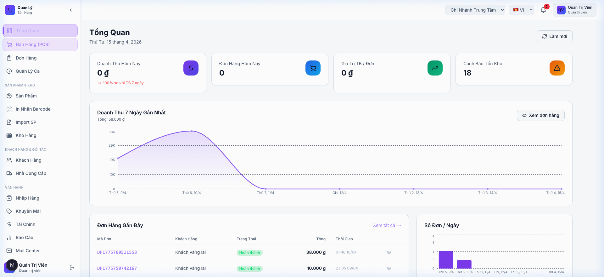
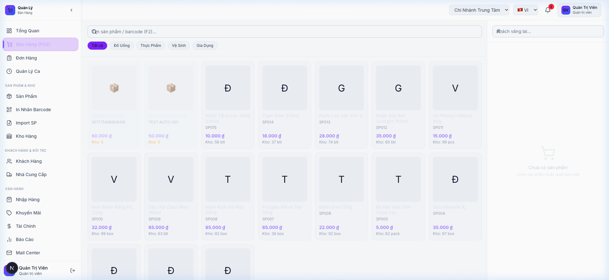
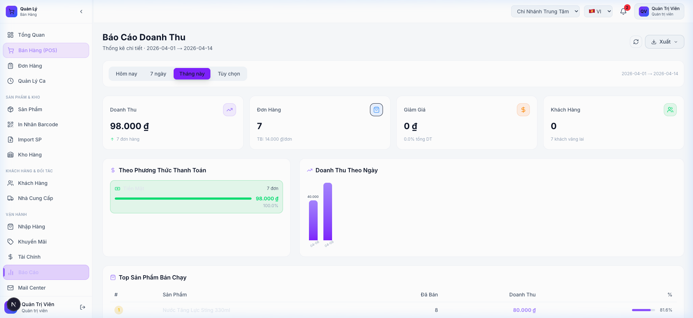
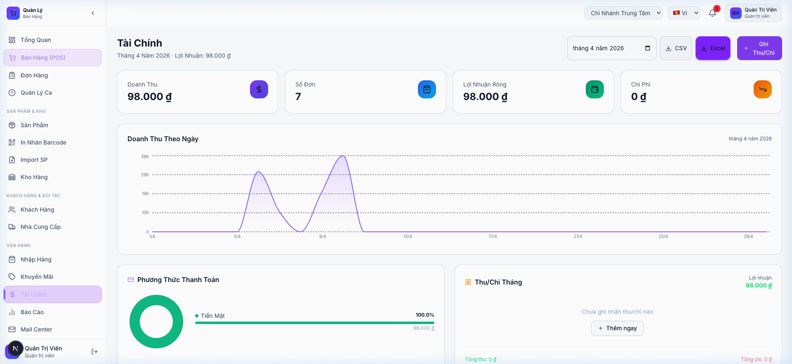
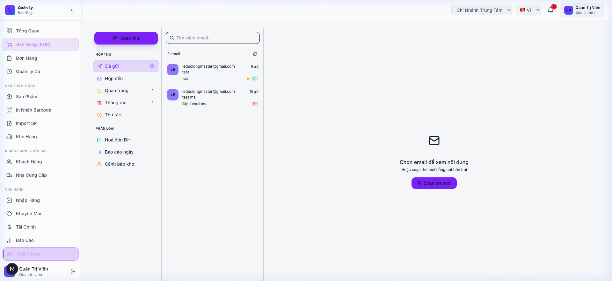
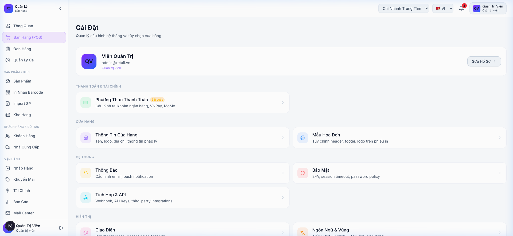

<div align="center">


# 🛒 VN Retail OS

**Phần mềm quản lý bán lẻ mã nguồn mở | Open-source Retail Management System | 开源零售管理系统**

[](https://nextjs.org)
[](https://nestjs.com)
[](https://www.typescriptlang.org)
[](https://prisma.io)
[](https://www.postgresql.org)
[](LICENSE)
[](CONTRIBUTING.md)

[🇻🇳 Tiếng Việt](#-tiếng-việt) · [🇺🇸 English](#-english) · [🇨🇳 中文](#-中文)

</div>

---

## 📸 Screenshots

<div align="center">

| Dashboard | POS Bán Hàng | Báo Cáo |
|-----------|-------------|---------|
|  |  |  |

| Tài Chính | Mail Center | Cài Đặt |
|-----------|------------|---------|
|  |  |  |

</div>

---

# 🇻🇳 Tiếng Việt

## Giới Thiệu

**VN Retail OS** là phần mềm quản lý bán lẻ full-stack, mã nguồn mở, được thiết kế đặc biệt cho thị trường Việt Nam. Hệ thống cung cấp đầy đủ các công cụ từ bán hàng tại quầy (POS), quản lý kho, CRM khách hàng, báo cáo tài chính đến in hóa đơn nhiệt — tất cả trong một nền tảng duy nhất.

## ✨ Tính Năng Chính

### 🛒 Bán Hàng (POS)
- Giao diện POS trực quan, hỗ trợ cảm ứng và bàn phím
- **Phím tắt**: F2 (tìm kiếm), F9 (thanh toán), F12 (xóa giỏ)
- 4 phương thức thanh toán: Tiền mặt, QR chuyển khoản, VNPay, MoMo
- Quét barcode tự động
- Quản lý ca làm việc
- Giảm giá / khuyến mãi linh hoạt

### 📦 Kho & Sản Phẩm
- CRUD sản phẩm với ảnh, barcode, đơn vị tính
- Import hàng loạt từ Excel/CSV (drag-drop)
- Xuất danh sách Excel (.xlsx) định dạng bảng chuyên nghiệp
- Theo dõi tồn kho, cảnh báo hàng sắp hết
- In nhãn barcode hàng loạt
- Quản lý nhập hàng (Purchase Orders)

### 👥 Khách Hàng & Đối Tác
- CRM khách hàng + lịch sử mua hàng + tích điểm loyalty
- Quản lý nhà cung cấp

### 📊 Báo Cáo & Tài Chính
- Biểu đồ doanh thu theo ngày/tuần/tháng
- Top sản phẩm bán chạy
- Thu/chi thủ công + tự động từ đơn hàng
- Xuất Excel (.xlsx) và CSV (tab-separated, tương thích Numbers/Excel)

### 🖨️ In Hóa Đơn Nhiệt
- Tích hợp **QZ Tray** — in trực tiếp không cần Print Preview
- Hỗ trợ khổ giấy 58mm và 80mm
- Fallback về browser print nếu chưa cài QZ Tray

### 🔐 Bảo Mật & Quản Trị
- Xác thực 2 lớp (2FA TOTP — Google Authenticator)
- Phân quyền chi tiết (SUPER_ADMIN, ADMIN, MANAGER, STAFF)
- Quản lý đa chi nhánh
- Mail Center nội bộ (Resend API)

### 📱 PWA & Offline
- Cài như app native trên điện thoại/máy tính
- Banner thông báo khi mất kết nối

## 🚀 Cài Đặt

### Yêu Cầu Hệ Thống
- Node.js >= 18
- pnpm >= 8
- Docker & Docker Compose
- PostgreSQL 16 (hoặc dùng Docker)

### Bước 1 — Clone & Cài Dependencies

```bash
git clone https://github.com/leduclong/vn-retail-os.git
cd vn-retail-os
pnpm install
```

### Bước 2 — Cấu Hình Môi Trường

```bash
# Backend
cp api/.env.example api/.env
# Sửa DATABASE_URL, JWT_SECRET, RESEND_API_KEY trong api/.env

# Frontend
cp web/.env.example web/.env.local
# Sửa NEXT_PUBLIC_API_URL=http://localhost:3001
```

### Bước 3 — Khởi Động Database

```bash
docker-compose up -d   # Chạy PostgreSQL + Redis + MailDev
```

### Bước 4 — Migrate & Seed Database

```bash
cd api
npx prisma migrate dev
npx prisma db seed
```

### Bước 5 — Chạy Ứng Dụng

```bash
# Terminal 1 — Backend (port 3001)
cd api && npm run start:dev

# Terminal 2 — Frontend (port 3000)
cd web && npm run dev
```

Mở trình duyệt: **http://localhost:3000**

**Tài khoản mặc định:**
```
Email:    admin@retail.vn
Password: Admin@123456
```

## 🏗️ Kiến Trúc Hệ Thống

```
┌─────────────────┐     ┌─────────────────┐     ┌──────────────┐
│  Next.js 14     │────▶│  NestJS API     │────▶│  PostgreSQL  │
│  (port 3000)    │     │  (port 3001)    │     │  + Redis     │
└─────────────────┘     └─────────────────┘     └──────────────┘
         │                       │
         │              ┌────────┴────────┐
         │              │   Resend Email  │
         │              │   QZ Tray Print │
         ▼              └─────────────────┘
    PWA / Offline
```

## 🤝 Đóng Góp

Chúng tôi rất hoan nghênh mọi đóng góp! Xem [CONTRIBUTING.md](CONTRIBUTING.md) để bắt đầu.

### Cách Đóng Góp
1. Fork repository
2. Tạo branch mới: `git checkout -b feature/ten-tinh-nang`
3. Commit theo Conventional Commits: `git commit -m "feat: thêm tính năng X"`
4. Push lên branch: `git push origin feature/ten-tinh-nang`
5. Tạo Pull Request

### Báo Cáo Lỗi
Vui lòng tạo [GitHub Issue](https://github.com/leduclong/vn-retail-os/issues) với mẫu:
- Mô tả lỗi
- Các bước tái hiện
- Ảnh chụp màn hình (nếu có)
- Môi trường (OS, Node version, trình duyệt)

---

# 🇺🇸 English

## Introduction

**VN Retail OS** is a full-stack, open-source retail management system built for the Vietnamese market but fully adaptable globally. It provides everything from Point-of-Sale (POS) operations, inventory management, customer CRM, financial reporting, to direct thermal printing — all in one unified platform.

## ✨ Key Features

### 🛒 Point of Sale (POS)
- Intuitive POS interface with touch and keyboard support
- **Keyboard shortcuts**: F2 (search), F9 (payment), F12 (clear cart)
- 4 payment methods: Cash, QR Transfer, VNPay, MoMo
- Automatic barcode scanning
- Shift management
- Flexible discounts & promotions

### 📦 Inventory & Products
- Full product CRUD with images, barcodes, units
- Bulk import from Excel/CSV (drag-and-drop)
- Professional Excel (.xlsx) export with table formatting
- Stock tracking with low-stock alerts
- Bulk barcode label printing
- Purchase Order management

### 👥 Customers & Partners
- Customer CRM + purchase history + loyalty points
- Supplier management

### 📊 Reports & Finance
- Revenue charts by day/week/month
- Top-selling products
- Manual + automatic income/expense tracking
- Export to Excel (.xlsx) and tab-separated CSV (compatible with Numbers/Excel)

### 🖨️ Thermal Printing
- **QZ Tray** integration — direct printing without Print Preview dialog
- Supports 58mm and 80mm paper widths
- Graceful fallback to browser print if QZ Tray is not installed

### 🔐 Security & Administration
- Two-Factor Authentication (2FA TOTP — Google Authenticator)
- Granular role-based access control (SUPER_ADMIN, ADMIN, MANAGER, STAFF)
- Multi-branch management
- Internal Mail Center (Resend API)

### 📱 PWA & Offline
- Installable as a native app on mobile/desktop
- Offline detection banner

## 🚀 Installation

### Requirements
- Node.js >= 18
- pnpm >= 8
- Docker & Docker Compose
- PostgreSQL 16 (or use Docker)

### Step 1 — Clone & Install

```bash
git clone https://github.com/leduclong/vn-retail-os.git
cd vn-retail-os
pnpm install
```

### Step 2 — Configure Environment

```bash
# Backend
cp api/.env.example api/.env
# Edit DATABASE_URL, JWT_SECRET, RESEND_API_KEY in api/.env

# Frontend
cp web/.env.example web/.env.local
# Set NEXT_PUBLIC_API_URL=http://localhost:3001
```

### Step 3 — Start Database

```bash
docker-compose up -d   # Starts PostgreSQL + Redis + MailDev
```

### Step 4 — Migrate & Seed

```bash
cd api
npx prisma migrate dev
npx prisma db seed
```

### Step 5 — Run Application

```bash
# Terminal 1 — Backend (port 3001)
cd api && npm run start:dev

# Terminal 2 — Frontend (port 3000)
cd web && npm run dev
```

Open browser: **http://localhost:3000**

**Default credentials:**
```
Email:    admin@retail.vn
Password: Admin@123456
```

## 🏗️ Architecture

```
┌─────────────────┐     ┌─────────────────┐     ┌──────────────┐
│  Next.js 14     │────▶│  NestJS API     │────▶│  PostgreSQL  │
│  (port 3000)    │     │  (port 3001)    │     │  + Redis     │
└─────────────────┘     └─────────────────┘     └──────────────┘
         │                       │
         │              ┌────────┴────────┐
         │              │   Resend Email  │
         │              │   QZ Tray Print │
         ▼              └─────────────────┘
    PWA / Offline
```

## 🛠️ Tech Stack

| Layer | Technology |
|---|---|
| Frontend | Next.js 14, TypeScript, TailwindCSS, Zustand |
| Backend | NestJS, Prisma ORM, PostgreSQL, Redis |
| Auth | JWT, 2FA TOTP |
| Email | Resend API |
| Printing | QZ Tray (ESC/POS) |
| Charts | Recharts |
| Excel | ExcelJS |
| PWA | @ducanh2912/next-pwa (Workbox) |

## 🤝 Contributing

We welcome all contributions! See [CONTRIBUTING.md](CONTRIBUTING.md) to get started.

### How to Contribute
1. Fork the repository
2. Create a new branch: `git checkout -b feature/your-feature-name`
3. Commit using Conventional Commits: `git commit -m "feat: add feature X"`
4. Push to branch: `git push origin feature/your-feature-name`
5. Open a Pull Request

### Reporting Bugs
Please open a [GitHub Issue](https://github.com/leduclong/vn-retail-os/issues) with:
- Bug description
- Steps to reproduce
- Screenshots (if applicable)
- Environment info (OS, Node version, browser)

---

# 🇨🇳 中文

## 项目介绍

**VN Retail OS** 是一款全栈开源零售管理系统，专为越南市场设计，同时也完全适用于全球市场。系统提供从收银台销售（POS）、库存管理、客户CRM、财务报告到热敏小票打印的全套解决方案，一体化平台，开箱即用。

## ✨ 主要功能

### 🛒 销售收银（POS）
- 直观的触屏与键盘双模式收银界面
- **快捷键**：F2（搜索商品）、F9（结账）、F12（清空购物车）
- 4种支付方式：现金、二维码转账、VNPay、MoMo
- 条形码自动扫描
- 班次管理
- 灵活折扣与促销

### 📦 库存与商品管理
- 完整的商品 CRUD（含图片、条码、计量单位）
- 支持从 Excel/CSV 批量导入（拖拽上传）
- 专业格式的 Excel (.xlsx) 报表导出
- 库存追踪，低库存预警
- 条形码标签批量打印
- 采购订单管理

### 👥 客户与合作伙伴
- 客户 CRM + 购买历史 + 积分管理
- 供应商管理

### 📊 报表与财务
- 按日/周/月的营收图表
- 热销商品排行
- 手动记账 + 订单自动收入统计
- 导出 Excel (.xlsx) 和 Tab 分隔 CSV（兼容 Numbers/Excel）

### 🖨️ 热敏小票打印
- 集成 **QZ Tray**，直接打印，无需弹出预览对话框
- 支持 58mm 和 80mm 纸张
- 未安装 QZ Tray 时，自动回退至浏览器打印

### 🔐 安全与权限管理
- 双因素认证（2FA TOTP — Google Authenticator）
- 精细角色权限（超级管理员、管理员、经理、员工）
- 多门店管理
- 内部邮件中心（Resend API）

### 📱 PWA 与离线支持
- 可安装为原生应用（桌面端/移动端）
- 网络断线检测提示横幅

## 🚀 安装部署

### 环境要求
- Node.js >= 18
- pnpm >= 8
- Docker & Docker Compose
- PostgreSQL 16（或使用 Docker）

### 第一步 — 克隆并安装依赖

```bash
git clone https://github.com/leduclong/vn-retail-os.git
cd vn-retail-os
pnpm install
```

### 第二步 — 配置环境变量

```bash
# 后端
cp api/.env.example api/.env
# 编辑 DATABASE_URL、JWT_SECRET、RESEND_API_KEY

# 前端
cp web/.env.example web/.env.local
# 设置 NEXT_PUBLIC_API_URL=http://localhost:3001
```

### 第三步 — 启动数据库

```bash
docker-compose up -d   # 启动 PostgreSQL + Redis + MailDev
```

### 第四步 — 数据库迁移与初始化

```bash
cd api
npx prisma migrate dev
npx prisma db seed
```

### 第五步 — 运行应用

```bash
# 终端 1 — 后端（端口 3001）
cd api && npm run start:dev

# 终端 2 — 前端（端口 3000）
cd web && npm run dev
```

打开浏览器：**http://localhost:3000**

**默认账户：**
```
邮箱：    admin@retail.vn
密码：    Admin@123456
```

## 🏗️ 系统架构

```
┌─────────────────┐     ┌─────────────────┐     ┌──────────────┐
│  Next.js 14     │────▶│  NestJS API     │────▶│  PostgreSQL  │
│  (端口 3000)    │     │  (端口 3001)    │     │  + Redis     │
└─────────────────┘     └─────────────────┘     └──────────────┘
         │                       │
         │              ┌────────┴────────┐
         │              │   Resend 邮件   │
         │              │   QZ Tray 打印  │
         ▼              └─────────────────┘
    PWA / 离线模式
```

## 🤝 参与贡献

我们诚挚欢迎各种形式的贡献！详见 [CONTRIBUTING.md](CONTRIBUTING.md)。

### 贡献流程
1. Fork 本仓库
2. 创建新分支：`git checkout -b feature/功能名称`
3. 使用约定式提交：`git commit -m "feat: 添加功能 X"`
4. 推送分支：`git push origin feature/功能名称`
5. 创建 Pull Request

### 报告问题
请通过 [GitHub Issue](https://github.com/leduclong/vn-retail-os/issues) 提交，包含：
- 问题描述
- 复现步骤
- 截图（如有）
- 环境信息（操作系统、Node版本、浏览器）

---

## 📄 License / Giấy Phép / 许可证

MIT License — Free to use, modify and distribute.  
Miễn phí sử dụng, chỉnh sửa và phân phối.  
免费使用、修改和分发。

---

## 💖 Ủng Hộ Dự Án / Support / 支持项目

Nếu dự án này hữu ích với bạn, xin hãy ủng hộ để duy trì phát triển! / If this project helps you, please consider supporting its development! / 如果本项目对您有帮助，欢迎捐款支持持续开发！

<div align="center">

| Phương thức / Method / 方式 | Địa chỉ / Address / 地址 |
|---|---|
| ₿ **Bitcoin (BTC)** | `bc1q4uk59kemaxkp4ny80p9cwdrdezwkametvp8km6` |
| Ξ **Ethereum (ETH)** | `0xE6cE0E0882573b75D9F96995d9F28130f08caD4a` |
| ◎ **Solana (SOL)** | `GhJGifxjkFTB6nBwZoZucnpy4mD3d9LVffubMojrEyGy` |
| 🏦 **BIDV (VN)** | `4120080475` — LE DUC LONG |

</div>

> ⭐ Đừng quên **Star** repository nếu bạn thấy hữu ích! / Don't forget to **Star** the repo! / 如果觉得有用，别忘了给个 **Star**！

---

<div align="center">

Made with ❤️ for Vietnamese Retail Businesses  
Được phát triển với ❤️ cho các doanh nghiệp bán lẻ Việt Nam  
为越南零售企业用心打造 ❤️

</div>
