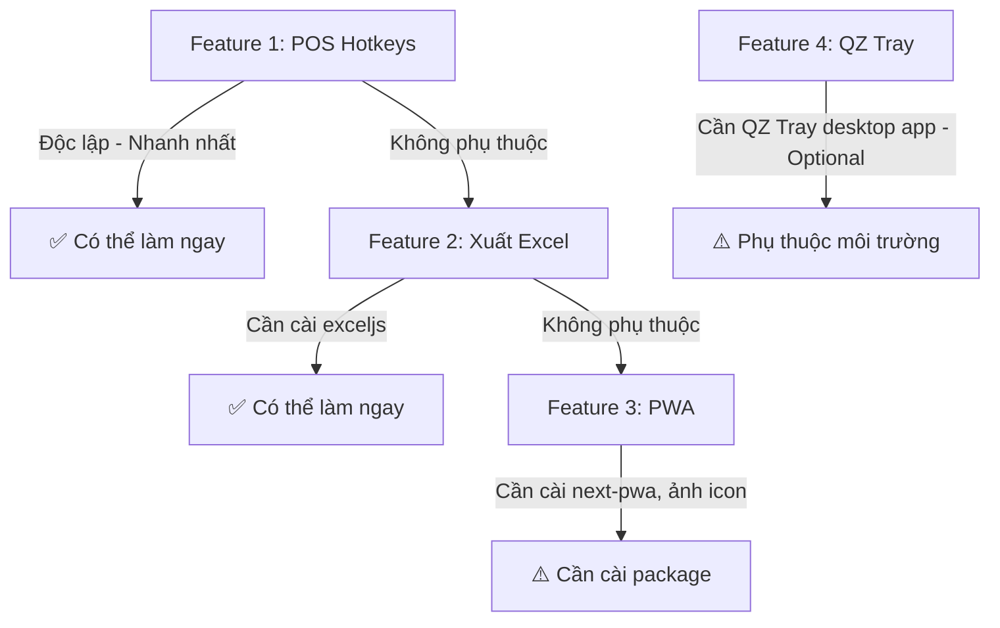

# VN Retail OS — Phase 4 Implementation Plan

> **Trạng thái:** ✅ HOÀN THÀNH — Đồng bộ 2026-04-14  
> **Tất cả 4 Feature đã triển khai + Hotfixes đã áp dụng**

## Mục tiêu
Triển khai 4 nhóm tính năng tối ưu hóa trải nghiệm vận hành thực tế cho VN Retail OS, được xây dựng trên nền hệ thống **đã ổn định** và tránh mọi trùng lặp với chức năng hiện có.

## Quyết định đã xác nhận

| # | Câu hỏi | Trả lời | Tác động |
|---|---|---|---|
| 1 | Khổ giấy máy in nhiệt | **58mm + 80mm + tùy chỉnh** | Thêm `PrintSizeSelector` trong Settings + hook hỗ trợ đa khổ |
| 2 | Icon PWA | **Túi market + biểu đồ cột** (đã generate) | Đã có file icon, tone tím violet phù hợp hệ thống |

### Preview Icon PWA đã generate


*Túi mua sắm tích hợp biểu đồ tăng trưởng — tone tím violet `#7c3aed` trên nền navy `#030712` — phù hợp 100% với design system của hệ thống.*

---

## Kiểm tra đối chiếu hệ thống (Audit Results)

### ✅ Đã có — KHÔNG làm lại
| Chức năng | Vị trí | Ghi chú |
|---|---|---|
| Import Excel/CSV sản phẩm | `/products/import/page.tsx` | **Đã đầy đủ** — 3 bước (Upload → Preview → Done), hỗ trợ drag-drop, XLSX/CSV, preview dạng table, import batch |
| Xuất CSV Doanh Thu | `/reports/page.tsx` | **Đã có** — exportCSV() + exportTopProductsCSV(), in PDF |
| Xuất CSV Tài chính | `/finance/page.tsx` | **Đã có** — exportCSV() gồm Thu/Chi/Lợi nhuận |
| Hotkey F2 (gợi ý text) | `pos/page.tsx` L195 | **Chỉ là placeholder text**, chưa có logic bắt phím thật |
| Biểu đồ Recharts Finance | `/finance/page.tsx` | Đã có AreaChart, Pie Chart đầy đủ |
| Barcode scanner | `BarcodeScanner` component | Đã có, hoạt động |

### 🔴 Chưa có — CẦN TRIỂN KHAI
| Tính năng | Lý do |
|---|---|
| POS Hotkeys thật (F2/F9/Esc/Enter) | Chỉ có text placeholder, KHÔNG có `useEffect keydown` nào trong codebase |
| Xuất Excel (.xlsx) thật | Chỉ có CSV hiện tại, user muốn xuất dạng **bảng (table)** |
| PWA / Offline Mode | Không có service worker, không có manifest |
| In Trực Tiếp Máy In Nhiệt | Chưa có tích hợp nào |

---

## User Review Required

> [!IMPORTANT]
> **Import Excel — ĐÃ TỒN TẠI đầy đủ:** Trang `/products/import` đã có đủ chức năng drag-drop, XLSX/CSV, preview bảng 7 cột, và import hàng loạt. Tôi sẽ **không** viết lại. Thay vào đó sẽ chỉ sửa button "Import Excel" ở trang danh sách sản phẩm để link đúng tới `/products/import`.

> [!IMPORTANT]
> **Xuất Báo Cáo — ĐÃ CÓ CSV, CẦN NÂNG CẤP sang XLSX:** Cả hai trang Reports và Finance đều có xuất CSV. Tôi sẽ nâng cấp thêm xuất định dạng **.xlsx** (Excel thật) với bảng có header styling, tô màu, để đáp ứng yêu cầu "định dạng bảng (table)" của bạn.

> [!WARNING]
> **PWA Offline:** Next.js 14 App Router yêu cầu cấu hình `next-pwa` cẩn thận. Cần cài thêm package `@ducanh2912/next-pwa`. Tôi sẽ chỉ cache các route POS và static assets, KHÔNG cache API calls có side-effects.

> [!WARNING]
> **In Máy In Nhiệt Trực Tiếp (LAN):** Cần cài **QZ Tray** (Java app) trên máy tính quầy thu ngân. Tôi sẽ tạo một hook `useThermalPrinter` tích hợp QZ Tray và giữ fallback về Print Preview của trình duyệt nếu chưa cài. Đây là giải pháp phổ biến nhất cho bán lẻ.

---

## Proposed Changes

### Feature 1 — POS Hotkeys (Phím Tắt Thật)

**Mục tiêu:** Nhân viên thu ngân thao tác 100% bằng bàn phím, không cần chuột.

| Phím | Hành động |
|---|---|
| **F2** | Focus vào ô tìm kiếm sản phẩm |
| **F9** | Mở Payment Modal (Thanh toán) khi có hàng trong giỏ |
| **F12** | Xóa giỏ hàng (Có confirm) |
| **Esc** | Đóng Modal đang mở (Payment/Receipt) |
| **Enter** | Trong Payment Modal → xác nhận thanh toán |
| **+/-** | Tăng/giảm số lượng sản phẩm được focus |

#### [MODIFY] [pos/page.tsx](file:///Volumes/PortableSSD/Congviec/Fullstack/retail-management/web/src/app/(dashboard)/pos/page.tsx)
- Thêm `useRef` cho search input.
- Thêm `useEffect` với `window.addEventListener('keydown', handleGlobalHotkey)`.
- Bọc handler với `useCallback` để tránh re-render.
- Truyền `onConfirm` Enter callback vào `PaymentModal`.

#### [NEW] [useHotkeys.ts](file:///Volumes/PortableSSD/Congviec/Fullstack/retail-management/web/src/hooks/useHotkeys.ts)
- Custom hook tái sử dụng nhận map `{ 'F2': handler, 'F9': handler }`.
- Tự động cleanup `removeEventListener` khi unmount.
- Bỏ qua hotkey khi focus đang ở trong `<input>`, `<textarea>` (trừ danh sách whitelist).

#### [MODIFY] [payment-modal.tsx](file:///Volumes/PortableSSD/Congviec/Fullstack/retail-management/web/src/components/pos/payment-modal.tsx)
- Nhận prop `onEnterConfirm` để xử lý phím Enter = Confirm thanh toán.

---

### Feature 2 — Xuất Excel (.XLSX) Dạng Bảng

**Mục tiêu:** Dữ liệu xuất ra là file `.xlsx` đúng chuẩn, có header tô màu tím, cột đúng độ rộng, dòng xen kẽ màu nền, tổng kết cuối file.

> **Thư viện:** `exceljs` — nhẹ hơn `xlsx`, chạy được hoàn toàn ở client-side browser, không cần server.

#### [NEW] [exportToExcel.ts](file:///Volumes/PortableSSD/Congviec/Fullstack/retail-management/web/src/lib/exportToExcel.ts)
Utility module dùng chung:
```typescript
// exportRevenueToExcel(orders, dateRange) → downloads .xlsx
// exportFinanceToExcel(expenses, summary) → downloads .xlsx
// exportProductsToXlsx(products) → downloads .xlsx (xuất danh sách sản phẩm)
```
Styling:
- Header row: nền tím `#7c3aed`, chữ trắng, **bold**
- Rows chẵn: nền `#0f172a` (dark), rows lẻ: `#1e293b`
- Cột tiền tệ: format `#,##0 "đ"`
- Cột ngày: format `dd/mm/yyyy hh:mm`
- Freeze row 1 (header đứng yên khi scroll)
- Auto-width các cột

#### [MODIFY] [reports/page.tsx](file:///Volumes/PortableSSD/Congviec/Fullstack/retail-management/web/src/app/(dashboard)/reports/page.tsx)
- Thêm import `exportRevenueToExcel`.
- Menu xuất thêm **"Xuất Excel (.xlsx)"** bên cạnh CSV.
- File xuất: `bao-cao-doanh-thu_[start]_[end].xlsx`
- Sheet 1: Tổng kết (KPI cards).
- Sheet 2: Chi tiết đơn hàng (bảng đầy đủ).
- Sheet 3: Top sản phẩm.

#### [MODIFY] [finance/page.tsx](file:///Volumes/PortableSSD/Congviec/Fullstack/retail-management/web/src/app/(dashboard)/finance/page.tsx)
- Nâng cấp button CSV → dropdown: CSV hoặc Excel.
- File xuất: `tai-chinh_[month].xlsx`
- Sheet 1: Tổng kết thu/chi/lợi nhuận.
- Sheet 2: Danh sách giao dịch Thu/Chi.
- Sheet 3: Doanh thu theo ngày (dạng bảng).

#### [NEW] Nút "Xuất Excel" tại trang Products
#### [MODIFY] [products/page.tsx](file:///Volumes/PortableSSD/Congviec/Fullstack/retail-management/web/src/app/(dashboard)/products/page.tsx)
- Fix button "Import Excel" để link đúng tới `/products/import` (hiện không có link).
- Thêm nút "Xuất Excel" bên cạnh Import để xuất danh sách sản phẩm hiện tại.

---

### Feature 3 — PWA / Offline Mode

**Mục tiêu:** Thu ngân vẫn sử dụng POS khi mất mạng. Dữ liệu đơn hàng chờ (pending) sẽ sync lên server khi có mạng lại.

> **Thư viện:** `@ducanh2912/next-pwa` — bộ wrapper Next.js 14 compatible của Workbox.

**Phạm vi cache (Caching Strategy):**
| Loại | Strategy | TTL |
|---|---|---|
| Static assets (JS/CSS) | CacheFirst | ~30 ngày |
| Google Fonts | StaleWhileRevalidate | 7 ngày |
| API `/products` | NetworkFirst | 5 phút |
| API `/categories` | CacheFirst | 1 giờ |
| API `/orders` POST | **KHÔNG cache** — luôn network |

#### [MODIFY] [next.config.ts](file:///Volumes/PortableSSD/Congviec/Fullstack/retail-management/web/next.config.ts)
- Wrap config với `withPWA({ dest: 'public', disable: process.env.NODE_ENV === 'development' })`.

#### [NEW] [manifest.json](file:///Volumes/PortableSSD/Congviec/Fullstack/retail-management/web/public/manifest.json)
- `name`: "VN Retail OS", `short_name`: "RetailOS"
- `theme_color`: "#7c3aed", `background_color`: "#030712"
- Icons đã có sẵn (đã generate):
  - `icon-192.png`: resize từ icon gốc (túi market + biểu đồ, tím violet)
  - `icon-512.png`: full-size version
  - `icon-maskable-512.png`: version với safe zone padding 10% cho Android Adaptive Icons
- `start_url`: "/pos", `display`: "standalone"
- `screenshots`: 2 screenshot (mobile + desktop) để hiện thị trong Install prompt

#### [MODIFY] [layout.tsx](file:///Volumes/PortableSSD/Congviec/Fullstack/retail-management/web/src/app/layout.tsx)
- Thêm `<link rel="manifest" href="/manifest.json" />`.
- Thêm `<meta name="theme-color" content="#7c3aed" />`.

#### [NEW] [OfflineBanner.tsx](file:///Volumes/PortableSSD/Congviec/Fullstack/retail-management/web/src/components/OfflineBanner.tsx)
- Component dùng `navigator.onLine` + `window.addEventListener('offline'/'online')`.
- Khi offline: hiện banner màu vàng đỏ "⚠️ Đang offline — Dữ liệu có thể chưa được cập nhật mới nhất".
- Khi online lại: "✅ Đã kết nối lại" (tự ẩn sau 3 giây).

#### [MODIFY] [dashboard/layout.tsx](file:///Volumes/PortableSSD/Congviec/Fullstack/retail-management/web/src/app/(dashboard)/layout.tsx)
- Nhúng `<OfflineBanner />` vào layout.

---

### Feature 4 — In Trực Tiếp Máy In Nhiệt (QZ Tray)

**Mục tiêu:** In hóa đơn nhiệt **không bật Print Preview** của trình duyệt. Hóa đơn xuất trong vòng < 1 giây kể từ lúc bấm xác nhận thanh toán.

**Hỗ trợ khổ giấy:**

| Khổ | Ký hiệu | Số ký/dòng | Phổ biến tại |
|---|---|---|---|
| 58mm | `paper58` | 32 ký tự | Máy in mini, quán cà phê, trà sữa |
| 80mm | `paper80` | 48 ký tự | Siêu thị, cửa hàng bán lẻ chuẩn |
| Tùy chỉnh | `custom` | Người dùng nhập | Máy in đặc biệt |

**Kiến trúc:**
```
Receipt Modal → useThermalPrinter hook → 
  ├─ QZ Tray available? → In trực tiếp qua ESC/POS Commands
  └─ Fallback → window.print() với CSS @media print (responsive)

                  ↓
       buildEscPosReceipt(order, paperSize)
         ├─ paper58: 32 chars/line — compact layout
         ├─ paper80: 48 chars/line — standard layout  
         └─ custom:  user-defined chars/line
```

#### [NEW] [useThermalPrinter.ts](file:///Volumes/PortableSSD/Congviec/Fullstack/retail-management/web/src/hooks/useThermalPrinter.ts)
- Load QZ Tray JS client từ CDN (nếu chưa có).
- `connect()`: kết nối WebSocket tới QZ Tray daemon trên localhost:8182.
- `printReceipt(orderData, paperSize)`: build ESC/POS command theo khổ giấy đã chọn.
- `isQzAvailable: boolean`: trạng thái kết nối.
- `paperSize: '58mm' | '80mm' | 'custom'`: lấy từ Settings store.
- Xử lý error gracefully, fallback về browser print.

#### [NEW] [receipt.utils.ts](file:///Volumes/PortableSSD/Congviec/Fullstack/retail-management/web/src/lib/receipt.utils.ts)
- `buildEscPosReceipt(order, config: PaperConfig)` → string ESC/POS commands.
- `PaperConfig`: `{ size: '58mm' | '80mm' | 'custom'; charsPerLine: number; fontSize: 1|2 }`
- Cấu trúc hóa đơn:
  ```
  ┌──────────────────────────────────────────────────┐
  │           [TÊN CỬA HÀNG - CHI NHÁNH]            │  ← Bold, Center
  │         [Địa chỉ] · [SĐT] · [Web]               │  ← Small, Center
  ├──────────────────────────────────────────────────┤
  │ Mã đơn: ORD-00123     14/04/2026 15:30           │
  │ Thu ngân: Nguyễn Văn A                           │
  │ Khách: Trần Thị B (VIP)                          │
  ├──────────────────────────────────────────────────┤
  │ Nước Suối Lavie 500ml                            │
  │   2 x 8,000đ                         16,000đ    │
  │ Mì Hảo Hảo Tom Chua Cay                         │
  │   5 x 4,500đ                         22,500đ    │
  ├──────────────────────────────────────────────────┤
  │ Tạm tính:                            38,500đ    │
  │ Giảm giá (KM20):                    -7,700đ    │
  │ TỔNG CỘNG:                           30,800đ    │  ← Bold, Large
  │ Tiền khách đưa:                      50,000đ    │
  │ Tiền thừa:                           19,200đ    │
  ├──────────────────────────────────────────────────┤
  │ PT Thanh toán: Tiền Mặt                          │
  │ Điểm tích lũy: +30 pts (Tổng: 1,230)            │
  ├──────────────────────────────────────────────────┤
  │           *** CẢM ƠN QUÝ KHÁCH ***              │
  │       Hotline: 0901234567                        │
  │  [     BARCODE: ORD-00123      ]                 │
  └──────────────────────────────────────────────────┘
  ```
- Tự động co dãn layout theo số ký tự/dòng.
- Cắt bớt tên sản phẩm dài hơn `charsPerLine - 10` ký tự và thêm `...`.

#### [MODIFY] [receipt-modal.tsx](file:///Volumes/PortableSSD/Congviec/Fullstack/retail-management/web/src/components/pos/receipt-modal.tsx)
- Import `useThermalPrinter`.
- Nút "In Hóa Đơn" giờ có 2 mode:
  - Nếu QZ connected: In nhiệt trực tiếp (icon printer xanh lá).
  - Nếu không: Fallback browser print (icon printer xám).
- Thêm indicator nhỏ góc phải: `● QZ Tray` (xanh = connected / đỏ = disconnected).

#### [NEW] Trang hướng dẫn cài đặt QZ Tray
#### [MODIFY] [settings/integrations/page.tsx](file:///Volumes/PortableSSD/Congviec/Fullstack/retail-management/web/src/app/(dashboard)/settings/integrations/page.tsx)
- Thêm card **"Máy in nhiệt (QZ Tray)"** với:
  - **Status badge**: 🟢 Connected / 🔴 Disconnected (auto-detect).
  - **Chọn khổ giấy**: Radio buttons — `58mm` / `80mm` / `Tùy chỉnh (nhập số ký tự/dòng)`.
  - **Chọn máy in**: Dropdown danh sách printer hệ thống (lấy từ QZ Tray API).
  - **Preview mẫu in**: Mini preview HTML hiển thị mẫu hóa đơn theo khổ giấy đã chọn (CSS `font-family: monospace`).
  - **Test print** button: In test page "Đây là test in thử từ VN Retail OS".
  - **Link tải QZ Tray** với hướng dẫn cài đặt ngắn gọn.
  - Lưu setting vào `localStorage` key `retailos_print_settings`.

---

## Bảng ưu tiên và phụ thuộc



| # | Tính năng | Độ phức tạp | Thời gian ước tính | Phụ thuộc |
|---|---|---|---|---|
| 1 | POS Hotkeys | Thấp | ~1 giờ | Không có |
| 2 | Xuất Excel (.xlsx) | Trung bình | ~2 giờ | `exceljs` |
| 3 | PWA Offline | Trung bình | ~1.5 giờ | `@ducanh2912/next-pwa` |
| 4 | In nhiệt QZ Tray | Cao | ~3 giờ | QZ Tray daemon |

---

## Open Questions

> [!NOTE]
> **Thứ tự ưu tiên:** Tất cả câu hỏi đã được trả lời. Sẵn sàng bắt tay triển khai theo thứ tự: **1 → 2 → 3 → 4** (từ nhanh nhất đến phức tạp nhất). Chờ xác nhận từ bạn.

---

## Verification Plan

### Automated Tests
```bash
# Sau mỗi feature, build để đảm bảo không có lỗi
cd web && pnpm build

# Kiểm tra PWA manifest
npx pwa-asset-generator --help

# Kiểm tra service worker registration
# → Chrome DevTools → Application → Service Workers
```

### Manual Verification

| # | Test Case | Expected |
|---|---|---|
| 1 | Mở POS, bấm F2 | Search input được focus |
| 1 | Thêm hàng vào giỏ, bấm F9 | Payment Modal mở |
| 1 | Trong Payment Modal, bấm Enter | Thanh toán thực hiện |
| 2 | Tại Reports, bấm "Xuất Excel" | File .xlsx tải về, mở được Excel, có header tím |
| 2 | Tại Finance, bấm "Xuất Excel" | File .xlsx gồm 3 sheets |
| 3 | Tắt WiFi, mở POS | Banner offline xuất hiện |
| 3 | Bật WiFi lại | Banner "Đã kết nối" hiện 3s rồi tắt |
| 3 | Mobile Chrome → Add to Home Screen | App cài được như native app |
| 4 | QZ Tray chạy → bấm In | Máy in nhiệt xuất hóa đơn < 1s |
| 4 | QZ Tray không chạy → bấm In | Browser print dialog mở |

---

## Hotfixes Sau Phase 4 (2026-04-14)

### HF-1: CSV Delimiter — Mac Numbers không tách cột
- **Vấn đề:** Dùng dấu phẩy `,` → Numbers đọc cả dòng là 1 cột
- **Fix:** Đổi sang tab `\t` + MIME `text/tab-separated-values`
- **Files:** `reports/page.tsx`, `finance/page.tsx`
- **Status:** ✅ Verified

### HF-2: Excel Finance — Sheet dữ liệu trống
- **Vấn đề:** Chỉ nhận manual expenses, không có đơn hàng trong sheet
- **Fix:** Expose `rawOrders` từ revenue query → truyền vào `exportFinanceToExcel`
- **Files:** `finance/page.tsx`, `exportToExcel.ts`
- **Status:** ✅ Verified

### HF-3: Excel Theme — Chữ khó đọc
- **Vấn đề:** Dark theme (navy) → chữ đen bị override → không đọc được
- **Fix:** Redesign sang light theme (white/lavender rows, slate-900 text)
- **File:** `src/lib/exportToExcel.ts`
- **Status:** ✅ Verified

### HF-4: Mail Center — Hardcode dark colors
- **Vấn đề:** Toàn bộ màu hardcode `bg-slate-900`, không theo theme
- **Fix:** Rewrite dùng CSS variables (`bg-card`, `text-foreground`, `border-border`)
- **File:** `src/app/(dashboard)/mail/page.tsx`
- **Status:** ✅ Verified

### HF-5: Mail Center iframe — Nền đen trong email body
- **Vấn đề:** iframe inherit `color-scheme: dark` từ app → nền đen
- **Fix:** Inject HTML wrapper với `color-scheme: light !important` vào `srcDoc`
- **File:** `src/app/(dashboard)/mail/page.tsx`
- **Status:** ✅ Verified
